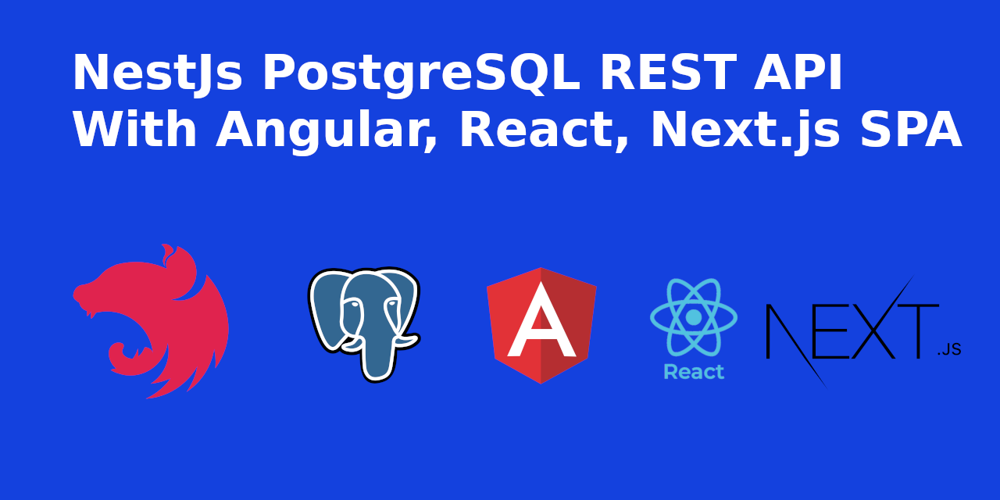

 
 

<strong>Headstart Single Page Application with Nestjs Angular, React, Next.js</strong>

An enterprise grade scalable NestJS boilerplate with Angular, React, Next.js SPA included.

 

# NestJS PostgreSQL REST API with Angular, React, Next.js
NestJS API integrated with Angular, React and Next.js

## Documentation
To read the complete documentation [click here](https://gitbook.io/)

## Authors
-   **Bishal Saha** - _Maintainer_ - [bishal-saha](https://github.com/bishal-saha)

## NestJs API Features
- _**Quick Setup**_ - Quickly setup and configure your application.
- _**CQRS Patter**_ - The command query responsibility segregation (CQRS) pattern separates the data mutation, or the command part of a system, from the query part.
- _**AutoMapper**_ - An object-object mapping solution by convention in TypeScript.